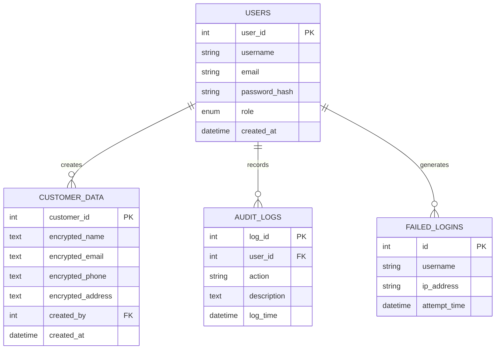
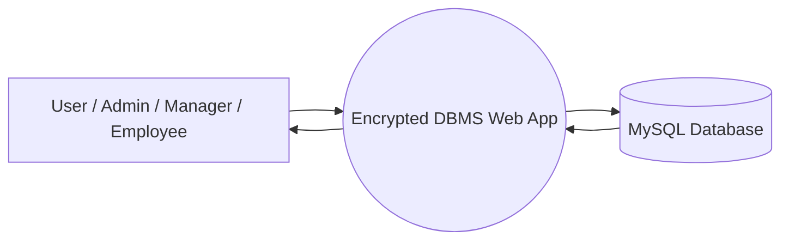
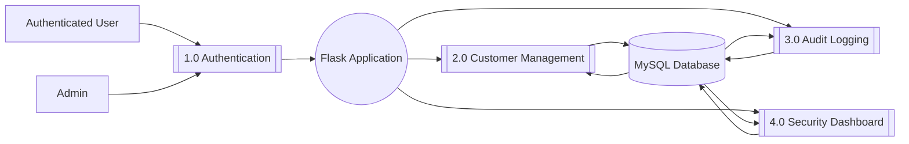
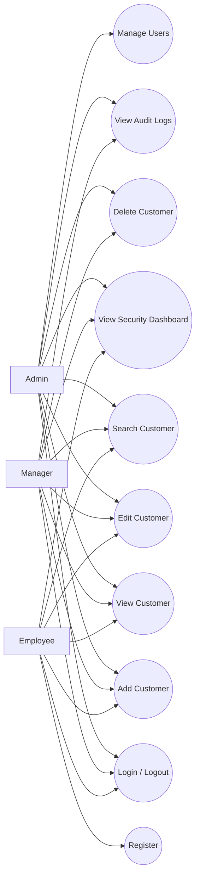

# Diagrams

## ER Diagram

## DFD Level 0

## DFD Level 1

## Use Case Diagram

## Notes

- The database stores customer fields in encrypted form.
- Search is performed after decryption in the application layer for authorized users.
- MySQL triggers write insert, update, and delete events into the audit trail.
